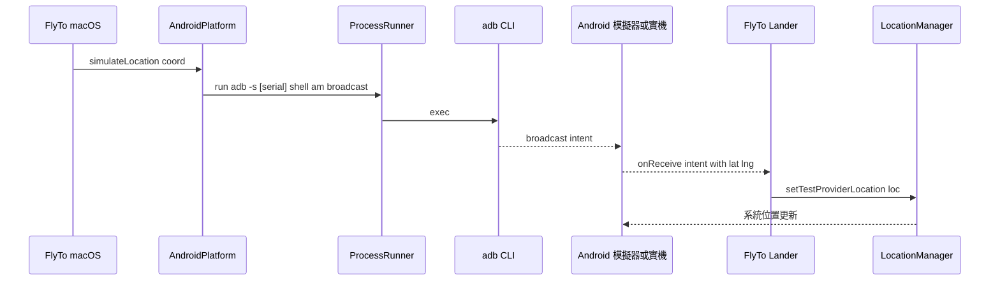

# Android 平台連線設計與測試環境

> **狀態：草稿（設計階段）**
> 對應功能：CLAUDE.md「平台支援矩陣」中尚未開工的 Android 端通訊與 helper App。
> Android 端 helper App 名稱：**FlyTo Lander**（獨立 Public repo：[`MingYuan-Tech/FlyTo-Lander`](https://github.com/MingYuan-Tech/FlyTo-Lander)，與 FlyTo macOS App 主 Private repo 分離）。
> 目標讀者：準備接手 Android 端 Platform 實作與 FlyTo Lander App 的工程師。
> 文件版本：2026-05-27

---

## 目錄

1. [目的與範疇](#1-目的與範疇)
2. [通訊技術選型](#2-通訊技術選型)
3. [測試環境策略（無實機情境）](#3-測試環境策略無實機情境)
4. [AVD 建立與操作](#4-avd-建立與操作)
5. [adb 指令清單](#5-adb-指令清單)
6. [FlyTo Lander 設計骨架](#6-flyto-lander-設計骨架)
7. [安全性與風險揭露（Phase 1 開工前約束）](#7-安全性與風險揭露phase-1-開工前約束)
8. [macOS 端 Platform 抽象對應](#8-macos-端-platform-抽象對應)
9. [已知限制與風險](#9-已知限制與風險)
10. [後續路線](#10-後續路線)
11. [參考資料](#11-參考資料)

---

## 1. 目的與範疇

> **術語約定：Android emulator ≠ iOS Simulator**
> Android 世界稱為 **emulator**（AVD，QEMU 跑完整 Android OS 的 CPU 虛擬化，行為接近實機）；iOS 世界才稱為 **Simulator**（跑 macOS 原生 binary 的 API 模擬，沒有完整 OS）。
> 本文件以下統一使用 **AVD / Android emulator**，請勿與 iOS 端的 `iOSSimulatorPlatform` 混為一談。

### 1.1 為什麼要支援 Android

FlyTo 主軸是 iOS GPS 模擬，但 [`CLAUDE.md`](../CLAUDE.md) 在「平台支援矩陣」已預留 Android 為第三平台，使用者群中亦有「同時在 Android 上測試自家 App 定位行為」的需求。

### 1.2 範疇

| 包含 | 不包含 |
|------|--------|
| macOS App ↔ adb ↔ Android 模擬器/實機 的通訊設計 | Android 端模擬器（avd/emulator）本身的修改 |
| Android 端 **FlyTo Lander** App（持有 Mock Location 權限的 helper） | Google Play 上架（Google 政策禁止 mock location 類 App） |
| 無 Android 實機情境下的測試策略 | iOS Platform 既有功能的回歸 |
| 與既有 `Platform` 協議的對應 | Android Wear / Auto / TV 支援 |

### 1.3 待補項目

- Android 廠商客製化 ROM（MIUI / OneUI / ColorOS）的 Mock Location 開關位置差異實測表
- 實機測試裝置採購計畫（見 [§10](#10-後續路線)）

---

## 2. 通訊技術選型

### 2.1 為什麼是 adb broadcast

| 候選 | 評估 |
|------|------|
| **adb shell `am broadcast`** ✅ | 官方工具、零額外依賴、可同時支援 emulator / USB 實機 / Wi-Fi 實機（`adb connect`），與既有 `ProcessRunner` 模式高度一致 |
| ADB Debug Tunnel + 自建 socket | 需在 Android App 自建 socket server，且權限要求更高，過度設計 |
| Companion App + Bonjour | 需在 Android 端常駐網路服務，電量負擔、防火牆 NAT 麻煩 |
| 直接呼叫 LocationManager（無需 App） | 不可行；Android 9+ 起 `setTestProviderLocation` 必須由 App 內呼叫且需 `ACCESS_MOCK_LOCATION` 透過 Developer Options 指定。adb shell 的 uid=2000 不對應任何 package，`AppOpsManager.checkOp(OP_MOCK_LOCATION)` 永遠 reject。Phase 0 已實測證實。 |

選定 **adb broadcast → FlyTo Lander BroadcastReceiver → 系統 Mock Location Provider** 三段式。此架構與 Appium、BrowserStack、Sauce Labs、HeadSpin、Bitbar 等業界自動化測試平台一致，是 AOSP 安全模型下的唯一合法路徑。

### 2.2 整體流程



### 2.3 Intent 格式

| 欄位 | 內容 |
|------|------|
| Action | `com.mingyuan.flyto.lander.SET_LOCATION` |
| Component | `com.mingyuan.flyto.lander/.LocationBroadcastReceiver`（顯式指定） |
| Extras | `lat:double`、`lng:double`、`alt:double?`、`speed:float?`、`bearing:float?`、`accuracy:float?`、`ts:long?` |
| 對應 adb | `adb -s <serial> shell am broadcast -n com.mingyuan.flyto.lander/.LocationBroadcastReceiver -a com.mingyuan.flyto.lander.SET_LOCATION --ed lat 25.033964 --ed lng 121.564468` |

clear 動作另一個 action：`com.mingyuan.flyto.lander.CLEAR_LOCATION`（無 extras）。

**關鍵 flag**：
- `-n <component>`：顯式指定 receiver，**必要**，繞過 Android 8.0+ 對 implicit broadcast 的 Background Execution Limits（否則 broadcast 會被 system server 丟棄並 log `Background execution not allowed`）
- `--ed`（double）：lat / lng / alt 用 double 傳；`--ef`（float）對應 `getDoubleExtra` 會回 NaN
- `--ef`：speed / bearing / accuracy 用 float
- `--el`：ts 用 long

> 精度規範沿用 [`CLAUDE.md`](../CLAUDE.md)：座標 6 位小數。

---

## 3. 測試環境策略（無實機情境）

### 3.1 結論

**主開發環境使用 AVD（Android Studio Virtual Device）**，可涵蓋 90% 以上的 Platform 程式碼驗證；Release 前再以二手實機補測廠商客製化 ROM 行為。

### 3.2 涵蓋率對照

| 驗證項目 | AVD | 實機 |
|---------|-----|------|
| `adb devices` 偵測 | ✅ | ✅ |
| `am broadcast` 指令 | ✅ | ✅ |
| Mock Location Provider 註冊 | ✅ | ✅ |
| Developer Options「Select mock location app」流程 | ✅ | ✅ |
| 系統 Location API 回傳的座標 | ✅ | ✅ |
| Wi-Fi `adb connect` 場景 | ⚠️ 僅 localhost：5555+ | ✅ 完整 |
| USB 拔插重新偵測 | ❌ | ✅ |
| MIUI / OneUI / ColorOS Mock Location 開關位置差異 | ❌ | ✅ |
| 廠商定位融合（GMS / HMS）行為 | ⚠️ GMS only | ✅ |

### 3.3 多版本矩陣建議

| AVD 名稱 | API Level | Android 版本 | 目的 |
|---------|-----------|-------------|------|
| `flyto_pixel6_api29` | 29 | 10 | 最低支援版本（暫定） |
| `flyto_pixel6_api33` | 33 | 13 | 中間主流 |
| `flyto_pixel7_api34` | 34 | 14 | 最新支援 |

> 最低支援 API Level 待 Android 端正式立項時敲定，本表先以 API 29 為起點。

#### 3.3.1 系統映像 ABI 選擇

ABI 必須與開發機 CPU 架構一致（QEMU 不支援跨架構模擬，否則 emulator 會 `FATAL: System image must match the host architecture` 直接 quit）。

| 開發機 | 用 `uname -m` 確認 | 應選 ABI |
|--------|------------------|---------|
| Apple Silicon Mac（M1/M2/M3/M4） | `arm64` | `arm64-v8a` |
| Intel Mac | `x86_64` | `x86_64` |

`sdkmanager` 下載指令對應為 `system-images;android-<API>;google_apis;<ABI>`。

### 3.4 雲端真機平台（暫不採用）

| 平台 | 評估 |
|------|------|
| Firebase Test Lab | 適合 CI 自動化測試，但互動式偵錯不便（每次 session 上限 30 分鐘） |
| BrowserStack App Live | 可互動，但每月費用偏高、adb 走遠端 tunnel 延遲明顯 |
| AWS Device Farm | 同 Firebase，偏向 CI |

決策：本期不採用，等實機測試暴露出多廠商相容性問題、或 CI 流程成熟後再評估。

---

## 4. AVD 建立與操作

> 本節指令以 Android Studio Hedgehog (2023.1) 或更新版本為前提。**系統映像 ABI 必須與開發機 CPU 架構一致**（見 [§3.3.1](#331-系統映像-abi-選擇)）。

### 4.1 建立 AVD

1. 安裝 Android Studio：https://developer.android.com/studio
2. 開啟 **Device Manager → Create Device** → 選 Pixel 6（或同等級樣板）
3. 系統映像 ABI 依開發機架構選（[§3.3.1](#331-系統映像-abi-選擇)）：Apple Silicon 選 `arm64-v8a`、Intel Mac 選 `x86_64`
4. 完成後啟動 emulator

### 4.2 確認 emulator 已上線

```bash
adb devices
# 預期輸出：
# emulator-5554   device
```

### 4.3 啟用 Mock Location App

emulator 第一次啟動後：

1. 安裝 **FlyTo Lander**（見 [§6](#6-flyto-lander-設計骨架)）：`adb install flyto-lander.apk`
2. emulator 內：**設定 → 關於手機 → 連點 7 次 Build number** 解鎖開發者選項
3. **設定 → 系統 → 開發者選項 → Select mock location app → 選 FlyTo Lander**
4. 驗證：`adb shell appops get com.mingyuan.flyto.lander android:mock_location` 應為 `allow`

### 4.4 用 emulator console 直接注入位置（除錯捷徑）

開發階段若尚未安裝 FlyTo Lander，可先用 emulator 內建指令快速驗證 macOS 端流程：

```bash
# 取得 console port（emulator-5554 → console port 5554）
telnet localhost 5554
> auth <token>   # token 路徑：~/.emulator_console_auth_token
> geo fix 121.564468 25.033964
```

> 注意：`geo fix` 與 broadcast 路徑「不是同一條」 — 它跳過 App，直接灌進 emulator 的 GPS HAL，且只有 AVD 才有此介面（實機沒有 emulator console）。
> **用途**：只在還沒安裝 FlyTo Lander 時的早期驗證；正式測試還是要走 broadcast 路徑。

---

## 5. adb 指令清單

### 5.1 設備管理

```bash
adb devices -l                       # 列出設備（含 model / transport_id）
adb -s <serial> shell getprop ro.product.model
adb connect <ip>:5555                # Wi-Fi 連線
adb disconnect <ip>:5555
```

### 5.2 模擬位置

```bash
# 設定座標
adb -s <serial> shell am broadcast \
  -n com.mingyuan.flyto.lander/.LocationBroadcastReceiver \
  -a com.mingyuan.flyto.lander.SET_LOCATION \
  --ed lat 25.033964 --ed lng 121.564468

# 清除模擬位置
adb -s <serial> shell am broadcast \
  -n com.mingyuan.flyto.lander/.LocationBroadcastReceiver \
  -a com.mingyuan.flyto.lander.CLEAR_LOCATION
```

> 兩個關鍵 flag：`-n <component>` 繞過 Background Execution Limits、`--ed` (double) 對應 `getDoubleExtra`（用 `--ef` float 會 NaN）。

### 5.3 App 管理（FlyTo Lander 安裝 / 升級）

```bash
adb -s <serial> install -r flyto-lander.apk
adb -s <serial> uninstall com.mingyuan.flyto.lander
adb -s <serial> shell am start -n com.mingyuan.flyto.lander/.MainActivity
```

### 5.4 日誌

```bash
adb -s <serial> logcat -s FlyToLander:V *:S
```

---

## 6. FlyTo Lander 設計骨架

> FlyTo Lander 是 FlyTo macOS App 在 Android 端的 helper App，負責接收 macOS 透過 adb 發來的 broadcast，並呼叫系統 `LocationManager.setTestProviderLocation` 灌入模擬座標。
> Repo：[`MingYuan-Tech/FlyTo-Lander`](https://github.com/MingYuan-Tech/FlyTo-Lander)（Public，獨立於 FlyTo macOS App 主 Private repo）。
> 命名語意：FlyTo 在 Mac 起飛、Lander 在 Android 降落於目標座標。

### 6.1 必要元件

| 元件 | 職責 |
|------|------|
| `LocationBroadcastReceiver` | 監聽 `SET_LOCATION` / `CLEAR_LOCATION`，解析 Intent extras，呼叫 `MockProvider` |
| `MockProvider` | 包裝 `LocationManager.addTestProvider` / `setTestProviderLocation` / `removeTestProvider` |
| `MainActivity`（Compose） | 顯示三段透明聲明 + 即時狀態（授權狀態、最後座標、最後 broadcast 來源 UID），引導使用者開啟 Developer Options |
| `BootCompletedReceiver`（選配） | 開機後預先註冊 Test Provider，避免首次廣播失敗 |

### 6.2 必要 Permission

| Permission | 用途 |
|-----------|------|
| `android.permission.ACCESS_MOCK_LOCATION` | 註冊 Test Provider（Android 6.0+ 由 Developer Options 控制，不必 runtime request） |
| `android.permission.ACCESS_FINE_LOCATION` | 部分 OEM ROM 要求 |
| `android.permission.RECEIVE_BOOT_COMPLETED` | 開機後預註冊（選配） |

**絕對不請求**的 permission 詳見 [§7.3](#73-第二層最小權限defensive-manifest)。

### 6.3 設計原則

- 套件名：`com.mingyuan.flyto.lander`
- APK 散佈：自家 GitHub Release（Public repo），絕不上 Google Play（政策禁止）
- 零第三方依賴：僅 Kotlin stdlib + AndroidX core/appcompat + Compose Material；無 Firebase / Crashlytics / Sentry / App Center 等 SDK
- UI 極簡：工具感，不放品牌動畫；顯示即時狀態方便除錯
- 安全約束：[§7](#7-安全性與風險揭露phase-1-開工前約束) 為硬性 gate，Phase 1 結束前必須通過 [§7.8 驗收 checklist](#78-驗收-checklistphase-1-結束前必須通過)

---

## 7. 安全性與風險揭露（Phase 1 開工前約束）

> 本節為 **Phase 1 開工前的硬性設計約束**，不是建議。Phase 1 任何實作不得違反本節原則；違反者視同 bug，需修正後才能 release。
> 動機：Android 系統權限模型較寬鬆（USB Debugging、sideload APK、Mock Location 皆可由使用者開啟），FlyTo Lander 直接觸碰這些敏感能力，使用者有合理的安全疑慮。本節以「設計＋文件」化解疑慮，不犧牲功能。

### 7.1 使用者面對的攻擊面

要使用 FlyTo Android 功能，使用者需依序啟用：

| 步驟 | 風險 |
|------|------|
| 開啟 Developer Options | 系統設定被改的入口 |
| 啟用 USB Debugging | 任何接得到 USB 的人都能 `adb shell` 該裝置 |
| sideload `flyto-lander.apk`（來自 GitHub Release） | App 可能藏惡意行為 |
| 授予 `ACCESS_MOCK_LOCATION`（Developer Options 選為 Mock Location App） | App 可以欺騙系統位置 |

每一層都需對應的信任建立機制，否則使用者疑慮無法被回應。

### 7.2 第一層：可審計（Auditability）

- **FlyTo Lander 程式碼完全開源**：獨立 Public repo [`MingYuan-Tech/FlyTo-Lander`](https://github.com/MingYuan-Tech/FlyTo-Lander)，與 FlyTo macOS App 主 Private repo 分離；macOS App 仍維持 Private
- **Reproducible Build**：每次 release 在 release note 公開「git commit + Gradle 版本 + AGP 版本 + JDK 版本」，使用者可從 source code 重建出同 SHA-256 的 APK 驗證
- **GPG 簽署 release tag**：使用者可驗證 release 確實來自工作室
- **APK signing key 公開指紋**：在 README 公布 keystore SHA-256 指紋，使用者可比對

### 7.3 第二層：最小權限（Defensive Manifest）

`AndroidManifest.xml` **絕對不得**請求以下 permission：

| Permission | 不請求理由 |
|-----------|----------|
| `android.permission.INTERNET` | **核心承諾**。App 無網路即無法外洩任何資料 |
| `android.permission.ACCESS_NETWORK_STATE` | 同上 |
| `android.permission.READ_PHONE_STATE` | 不需 IMEI / 電話狀態 |
| `android.permission.READ_EXTERNAL_STORAGE` / `WRITE_EXTERNAL_STORAGE` | 不存任何檔案 |
| `android.permission.ACCESS_BACKGROUND_LOCATION` | 不需背景讀取真實位置 |
| `android.permission.QUERY_ALL_PACKAGES` | 不需查詢其他 App |

僅請求 [§6.2](#62-必要-permission) 列出的三個必要 permission。

> README 一級顯眼處必須有橫幅：「**This app requests NO `INTERNET` permission. Verify in `AndroidManifest.xml`.**」

### 7.4 第三層：技術層硬隔離（Code-level safeguards）

- **不持久化座標**：每筆 broadcast 處理完即釋放，禁止寫入 `SharedPreferences` / Room / 任何檔案 / 任何 DB
- **零 analytics / 零 crash report 上傳**：不引入 Firebase、Crashlytics、App Center、Sentry 等 SDK；即使 Crash 也只走系統內建 Logcat
- **零第三方依賴**：`build.gradle` 的 dependencies 只允許 Kotlin stdlib + AndroidX core/appcompat + Compose Material；任何新增依賴需單獨評估（呼應 [`CLAUDE.md`](../CLAUDE.md) 「不使用任何第三方函式庫」精神）
- **限制 broadcast 來源**：在 `LocationBroadcastReceiver.onReceive` 內檢查 `Binder.getCallingUid()`，只允許 uid 2000（`shell`）、uid 0（`root`）與本 App 自身發起的 broadcast；其他 UID 一律丟棄並寫 Logcat
- **Receiver 暴露策略**：所有 Receiver 在 Manifest 明確宣告 `android:exported` 屬性：
  - `LocationBroadcastReceiver`：必須 `exported="true"`（要接 adb shell 來的 broadcast），但必須搭配上述 caller UID 白名單檢查
  - `BootCompletedReceiver`：`exported="false"`（只接系統廣播）
- **顯式 component broadcast**：macOS 端用 `adb shell am broadcast -n <package>/.LocationBroadcastReceiver -a <ACTION>` 顯式指定 component，繞過 Android 8.0+ 對 implicit broadcast 的 Background Execution Limits

### 7.5 第四層：UI 透明（In-app trust signals）

`MainActivity`（Compose）必須顯眼顯示三段保證 + 即時狀態：

```
┌──────────────────────────────────────┐
│  FlyTo Lander                        │
├──────────────────────────────────────┤
│  ✓ 本 App 不請求網路權限              │
│     AndroidManifest.xml 可驗證       │
│                                      │
│  ✓ 本 App 不蒐集任何資料              │
│     無 analytics、無 crash report    │
│                                      │
│  ✓ 程式碼公開                         │
│     github.com/MingYuan-Tech/         │
│     FlyTo-Lander                     │
├─── 即時狀態 ─────────────────────────┤
│  Mock Location 授權  ✓ 已授權         │
│  最後一次收到的座標  25.033964,       │
│                     121.564468        │
│                     @ 14:23:45        │
│  最後 broadcast 來源  uid=2000 (shell)│
└──────────────────────────────────────┘
```

UI 不放品牌動畫，保持工具感。

### 7.6 第五層：使用者文件化風險揭露

FlyTo Lander repo README 與 FlyTo macOS App 的 Android 設定流程文件中，必須明確列出：

1. **建議使用測試專用裝置**，不要裝在主力手機上（與 [§10 Phase 3](#10-後續路線) 採購二手機建議一致）
2. **USB Debugging 啟用後**，不要把手機接到不信任的電腦 / 公共充電站
3. **Mock Location 啟用後**，部分金融、防作弊類 App（如 Line Pay、行動銀行、神魔之塔）會檢測 `Location.isFromMockProvider()` 拒絕運行 —— 這是系統行為非 bug，用完關閉 Mock Location 即恢復
4. **完整移除步驟**：uninstall APK → Developer Options → Select mock location app → None → 關閉 USB Debugging → 關閉 Developer Options
5. **回報資安問題**：repo 開 GitHub Security Advisory 接收 responsible disclosure，並在 README 揭露 reporting 聯絡方式

### 7.7 第六層：定位為「業界一致做法」

此設計與 Appium `io.appium.settings`、BrowserStack、Sauce Labs、HeadSpin、Bitbar 等業界自動化測試平台採用相同雙端架構，是 AOSP `LocationManagerService.checkMockLocation()` 設計下的唯一合法路徑。文件中應明確標註此非 FlyTo 設計妥協，而是 Android 安全模型的硬性要求。

### 7.8 驗收 Checklist（Phase 1 結束前必須通過）

- [ ] `AndroidManifest.xml` 不含 `INTERNET` / `ACCESS_NETWORK_STATE` / 其他 [§7.3](#73-第二層最小權限defensive-manifest) 表中禁止 permission
- [ ] `build.gradle` dependencies 無 Firebase / Crashlytics / Sentry / App Center / 任何 analytics SDK
- [ ] `LocationBroadcastReceiver` 內有 `Binder.getCallingUid()` 來源檢查
- [ ] 所有 Receiver 在 Manifest 明確標 `android:exported`；對外暴露者（`exported="true"`）含 `Binder.getCallingUid()` 白名單檢查
- [ ] `MainActivity` UI 包含三段「不聯網 / 不蒐集 / 開源」聲明 + 即時狀態面板，截圖佐證附在 PR
- [ ] README 一級標題下方有 `This app requests NO INTERNET permission` 橫幅
- [ ] Release tag 有 GPG 簽章
- [ ] Release artifact 附 APK SHA-256
- [ ] CI 驗證 reproducible build：同一 commit 重複建置產生同 SHA-256 APK
- [ ] README 列出「使用前風險揭露」5 條（[§7.6](#76-第五層使用者文件化風險揭露)）

---

## 8. macOS 端 Platform 抽象對應

新增 `AndroidPlatform` 實作 `Platform` 協議（協議定義見 FlyTo 主 repo `Jaofeng/FlyTo` 內 `docs/02-software-design.md` §4「Platform 協議與兩個實作者」）：

| 協議方法 | AndroidPlatform 實作 |
|---------|---------------------|
| `discoverDevices()` | `adb devices -l` → 解析 serial / model |
| `connect(device)` | 對 Wi-Fi 走 `adb connect <ip>:5555`；USB 不需額外動作 |
| `disconnect(device)` | 對 Wi-Fi 走 `adb disconnect`；USB 不操作 |
| `isDeviceReachable(device)` | `adb -s <serial> get-state` 回 `device` 視為可達 |
| `simulateLocation(coord, device)` | `am broadcast -n com.mingyuan.flyto.lander/.LocationBroadcastReceiver -a com.mingyuan.flyto.lander.SET_LOCATION --ed lat ... --ed lng ...` |
| `clearSimulatedLocation(device)` | `am broadcast -n com.mingyuan.flyto.lander/.LocationBroadcastReceiver -a com.mingyuan.flyto.lander.CLEAR_LOCATION` |

> **注意**：必須用 `-n <component>` 顯式指定 receiver、`--ed`（double）傳座標。`--ef`（float）對應 `getDoubleExtra` 會回 NaN；省略 `-n` 會被 Android 8.0+ Background Execution Limits 擋掉。

### 8.1 adb 二進位來源

| 來源 | 評估 |
|------|------|
| 要求使用者自行安裝 platform-tools | ✅ 採用，最不污染環境；首次啟動時若偵測不到 `adb` 引導使用者下載 |
| App 內 bundle 一份 adb | ❌ 公證簽署複雜、二進位授權需確認 |
| Homebrew 自動安裝 | ❌ 不能假設使用者有 Homebrew |

決議：首次偵測不到 adb 時，UI 顯示三段式錯誤訊息（沿用 `CLAUDE.md` 規範），並提供 `https://developer.android.com/tools/releases/platform-tools` 連結。

### 8.2 與既有 `ProcessRunner` 的整合

直接沿用 `Core/Services/ProcessRunner`，與 `xcrun simctl` 的呼叫方式同構，無需新抽象。

---

## 9. 已知限制與風險

| 項目 | 影響 | 緩解 |
|------|------|------|
| 無實機，廠商客製 ROM 行為未驗證 | Release 後可能在 MIUI / OneUI 環境遇到 Mock Location 開關位置不同、Test Provider 註冊被拒等問題 | 採購二手實機（見 [§10](#10-後續路線)），Release Note 標註已驗證機型清單 |
| adb 版本與 Android 系統版本相容性 | 過舊 adb 對 Android 14+ 可能不支援部分指令 | 文件要求使用者使用最新 platform-tools |
| Wi-Fi adb 在不同網路環境穩定性 | NAT、防火牆可能阻擋 5555 port | 初版僅支援 USB，Wi-Fi 列為第二期 |
| Mock Location 在 Google Play Protect 風控下可能觸發警示 | 部分需要強防詐 App（銀行、行動支付）會偵測 Mock Location 並拒絕運行 | 文件揭露此為 Mock Location 機制本身限制，非 FlyTo bug |
| FlyTo Lander 無法在 Google Play 上架 | Google 政策禁止「協助 mock location」類 App | 計畫內，APK 走 GitHub Release 私下散佈 |

---

## 10. 後續路線

> 本路線僅供討論，正式優先序由使用者決定。

### Phase 0：環境準備（無實機階段） ✅ 已完成

- [x] 安裝 Android Studio + 對應架構系統映像
- [x] 建立 3 個 AVD（`flyto_pixel6_api29` / `flyto_pixel6_api33` / `flyto_pixel7_api34`，皆 x86_64）
- [x] 用 emulator console `geo fix` 跑通 macOS → adb → emulator console 路徑驗證

### Phase 1：FlyTo Lander 雛形 ✅ 已完成

- [x] 建立 [`MingYuan-Tech/FlyTo-Lander`](https://github.com/MingYuan-Tech/FlyTo-Lander) Public repo（Apache-2.0）
- [x] 建立 Android Studio 專案：Kotlin + Compose、minSdk 29、targetSdk 34、package `com.mingyuan.flyto.lander`
- [x] 實作 [§6.1](#61-必要元件) 列出的 4 個元件（含 `ReceiverState` 共用 state）
- [x] AndroidManifest 通過 [§7.3](#73-第二層最小權限defensive-manifest) permission 約束
- [x] CI 設定（GitHub Actions）：build / release / reproducible-build 三個 workflow
- [x] 通過 [§7.8 驗收 checklist](#78-驗收-checklistphase-1-結束前必須通過) 全部 10 條
- [x] 產出 debug APK；release signed APK 待 GitHub Secrets 設定後由 `release.yml` 自動產出
- [x] README 完成（含「No INTERNET permission」雙語橫幅、安裝步驟、移除步驟、5 條風險揭露、聯絡資訊）

> 首次 commit：[`d8d4cbb`](https://github.com/MingYuan-Tech/FlyTo-Lander/commit/d8d4cbb)（35 檔 / 2379 行，2026-05-27）

### Phase 2：macOS 端 `AndroidPlatform`

- [ ] 實作 `Platform` 協議的 6 個方法
- [ ] DeviceManager 整合（自動掃描 Android 裝置）
- [ ] UI Inspector 加入 Android 裝置類別圖示
- [ ] 三段式錯誤訊息（adb 不存在 / 未授權 / FlyTo Lander 未指定為 Mock App）
- [ ] FlyTo macOS App 文件中引導使用者下載 FlyTo Lander APK

### Phase 3：實機驗證

- [ ] 採購二手實機 1–2 台（建議 Pixel 二手 + Samsung A 系列各一）
- [ ] 實機行為對照表（Mock Location 開關位置、權限頁面差異、`isFromMockProvider` 偵測 App 清單）
- [ ] Release Note 列出已驗證機型

### Phase 4：進階場景

- [ ] Wi-Fi adb 連線支援
- [ ] 路線多點移動（在 Android 端對應 iOS 的 navigating 狀態）
- [ ] 多裝置同時模擬

---

## 11. 參考資料

| 主題 | 連結 |
|------|------|
| Android Platform Tools 下載 | https://developer.android.com/tools/releases/platform-tools |
| `am broadcast` 指令參考 | https://developer.android.com/tools/adb#am |
| Emulator Console 指令 | https://developer.android.com/studio/run/emulator-console |
| LocationManager Test Provider API | https://developer.android.com/reference/android/location/LocationManager#addTestProvider |
| Mock Location 與 App 風控 | https://developer.android.com/training/location/permissions#mock-location |
| AOSP `LocationManagerService` 原始碼 | https://cs.android.com/android/platform/superproject/+/master:frameworks/base/services/core/java/com/android/server/location/LocationManagerService.java |
| Appium io.appium.settings（業界對照） | https://github.com/appium/io.appium.settings |
| Reproducible Builds for Android | https://developer.android.com/about/versions/14/reproducible-builds |

### 相關文件

**本 repo（FlyTo-Lander）內：**
- [`CLAUDE.md`](../CLAUDE.md) — 本專案 Claude Code 指引、技術棧、§7 安全約束摘要
- [`README.md`](../README.md) — 使用者導覽、安裝步驟、5 條風險揭露
- [`SECURITY.md`](../SECURITY.md) — 資安回報流程

**FlyTo macOS 主 repo（Private）[`Jaofeng/FlyTo`](https://github.com/Jaofeng/FlyTo) 內：**
- `CLAUDE.md` — macOS 平台支援矩陣、Swift 編程硬性限制
- `docs/02-software-design.md` — `Platform` 協議、`ProcessRunner` 抽象（Phase 2 實作 `AndroidPlatform` 時對齊）
- `docs/01-system-analysis.md` — 系統範疇與目標使用者
